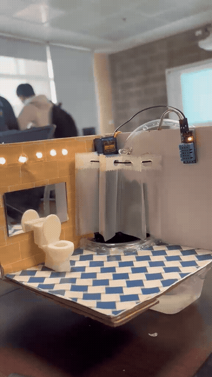
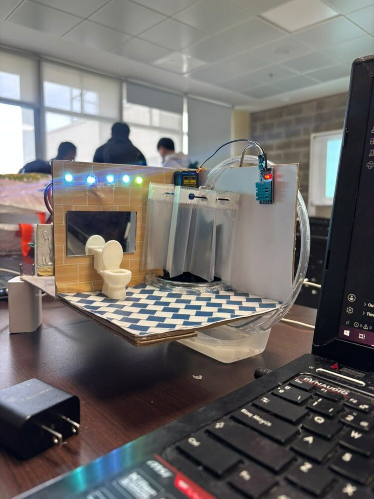
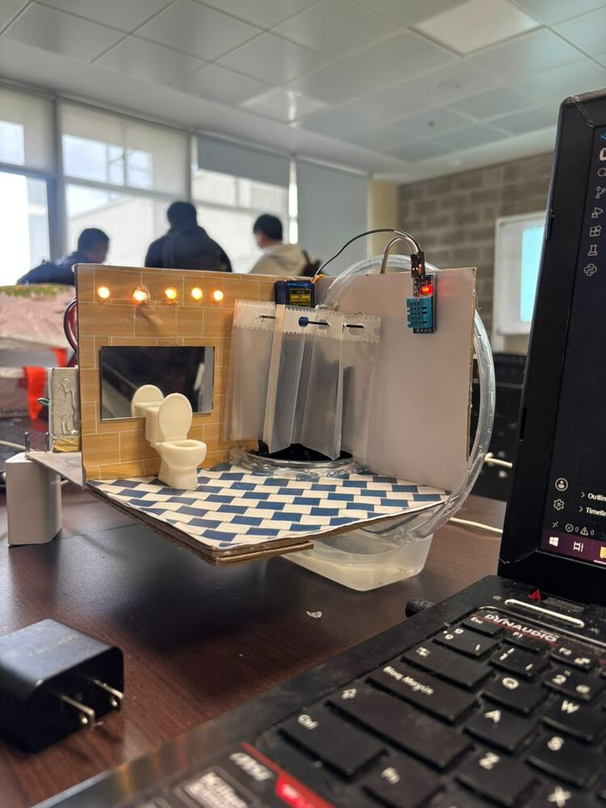
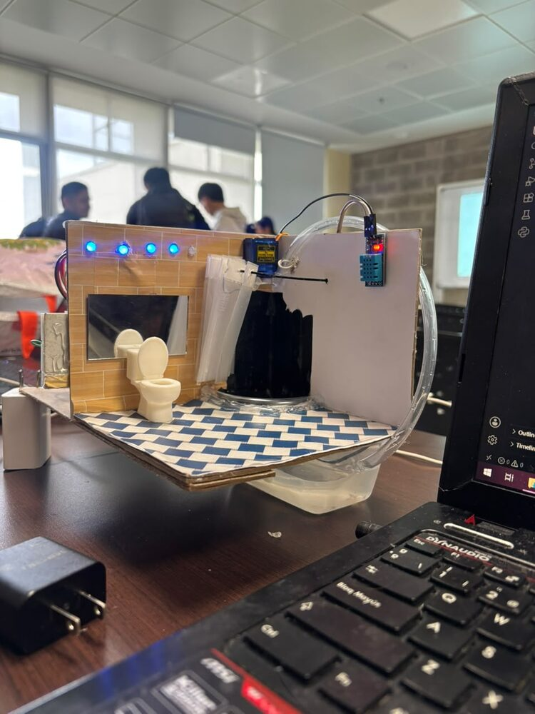

# 🛁 Sistema Baño Domótico

Proyecto de la Universidad Militar Nueva Granada — Ingeniería Mecatrónica.

Sistema de control para un baño inteligente que permite manejar iluminación,
ducha y persiana mediante **comandos de voz o texto en lenguaje natural**,
usando un microcontrolador **ESP32**, el protocolo **MQTT** y un modelo de
lenguaje (**Groq**) para interpretar lo que pide el usuario.

Se puede controlar desde:
- Una **consola de PC** (`chatbot_bano.py`)
- El **navegador del celular**, con un dashboard táctil y botón de micrófono
  (`app.py` + `templates/index.html`)

---

## 🎥 Demo y fotos del prototipo

Antes de entrar en el código, así se ve y se comporta el prototipo físico:
una maqueta de baño a escala con LEDs, sensor DHT11, servomotor (persiana) y
el ESP32 controlando todo por MQTT.

### Video de demostración



*El GIF de arriba es un fragmento corto y comprimido. Los videos completos,
sin recortar, están en [`assets/video/`](assets/video/):*

- 🎬 [Demo completo — interpretación de comando y movimiento de la persiana](assets/video/demo-completo-comandos.mp4)
- 🎬 [Detalle del servo y los sensores en funcionamiento](assets/video/detalle-persiana-sensores.mp4)

> **Nota:** GitHub solo reproduce en línea los archivos de video que se suben
> arrastrándolos directamente en el editor web de GitHub (quedan como enlaces
> `user-attachments`); los `.mp4` que viven dentro del repositorio se muestran
> como enlace de descarga, no como reproductor. Por eso arriba se usa un GIF
> (sí se reproduce solo) y los `.mp4` se dejan como enlace para ver la
> calidad completa. Si quieres que los videos completos se vean como
> reproductor embebido, puedes arrastrarlos una vez dentro del cuadro de
> edición del README en github.com; GitHub los sube y genera el enlace
> especial automáticamente.

### Fotos del prototipo

| Modo diurno | Modo nocturno | Detalle de hardware |
|---|---|---|
|  |  |  |

- **Modo diurno:** luces cálidas/blancas encendidas, simulando iluminación de día.
- **Modo nocturno:** luces azules tenues encendidas, simulando modo noche.
- **Detalle de hardware:** sensor DHT11, servomotor de la persiana y las
  "cortinas" de la ducha, todo conectado al ESP32.

---

## 📐 Arquitectura general

```
[Usuario habla o escribe]
        │
        ▼
┌─────────────────────┐        ┌───────────────────┐
│  chatbot_bano.py     │        │      app.py        │
│  (consola)           │        │  (servidor Flask)  │
└──────────┬───────────┘        └─────────┬─────────┘
           │                              │
           └──────────────┬───────────────┘
                          ▼
                  ┌───────────────┐
                  │  bano_core.py  │   <- lógica compartida
                  └───────┬───────┘
                          │
              ┌───────────┴───────────┐
              ▼                       ▼
      API Groq (interpreta       Broker MQTT público
      texto/voz → comando)       (broker.hivemq.com)
                                        │
                                        ▼
                              ┌──────────────────┐
                              │   ESP32           │
                              │ DuchaInteligente.ino│
                              └──────────────────┘
                                        │
                         LEDs, servo (persiana), sensor DHT11
```

**Idea clave:** toda la lógica de conexión MQTT y de interpretación de
lenguaje natural vive en un solo archivo (`bano_core.py`) para no
duplicarla entre la versión de consola y la versión web. Tanto
`chatbot_bano.py` como `app.py` solo se encargan de la interfaz
(consola o navegador) y llaman a las funciones de `bano_core.py`.

---

## 📁 Estructura del repositorio

```
Sistema-Bano-Domotico/
├── app.py                  # Servidor Flask (control desde el celular)
├── bano_core.py             # Lógica compartida: MQTT, Groq, Whisper
├── chatbot_bano.py          # Chatbot de consola
├── DuchaInteligente.ino      # Firmware del ESP32
├── templates/
│   └── index.html            # Interfaz móvil (HTML+CSS+JS)
├── assets/
│   ├── img/                  # Fotos del prototipo
│   └── video/                # GIF y videos de demostración
├── requirements.txt
├── .gitignore
└── README.md
```

---

## ⚙️ Requisitos

- Python 3.10+
- Una cuenta en [Groq](https://console.groq.com/) para obtener una API key
  gratuita (se usa para interpretar comandos y transcribir voz)
- Un ESP32 con los componentes: LEDs, sensor DHT11, micro-servo
- Arduino IDE (o PlatformIO) con las librerías: `DHT sensor library`,
  `ESP32Servo`, `PubSubClient`

Instalación de dependencias de Python:

```bash
pip install -r requirements.txt
```

Definir la API key de Groq como variable de entorno antes de correr
cualquiera de los dos programas:

```bash
# PowerShell
$env:GROQ_API_KEY = "tu_api_key_aqui"

# CMD
set GROQ_API_KEY=tu_api_key_aqui
```

---

## ▶️ Cómo correrlo

**Opción 1 — Consola:**
```bash
python chatbot_bano.py
```

**Opción 2 — Desde el celular (misma red WiFi):**
```bash
python app.py
```
Te dará una URL tipo `https://<IP-de-tu-PC>:5000` para abrir desde el
navegador del celular. El certificado será autofirmado (aparece una
advertencia, es normal — es tu propio servidor).

---

## 🧩 Explicación del código, bloque por bloque

### 1. `bano_core.py` — el cerebro compartido

**Configuración MQTT**
```python
BROKER = "broker.hivemq.com"
TOPIC_PREFIJO = "unimilitar_duchainteligente_hearvl2026"
```
Se usa un broker MQTT **público**, así que se define un prefijo único de
topic para no chocar con otros proyectos que usen el mismo broker. Este
mismo prefijo debe coincidir exactamente con el que está en el `.ino`.

**Configuración Groq y el prompt del sistema**
```python
COMANDOS_VALIDOS = ["diurno", "nocturno", "sauna", "encender ducha", ...]
PROMPT_SISTEMA = f"""Eres un intérprete de comandos..."""
```
Aquí se le explica al modelo de lenguaje, en un *prompt de sistema*, cuáles
son los únicos comandos válidos y cómo debe mapear frases en español
("enciende la ducha", "quiero dormir") a esos comandos exactos. También se
le indica que puede devolver **varios comandos separados por comas** si el
usuario pide más de una acción en un solo mensaje.

**Cliente MQTT y estado del baño**
```python
mqtt_client = mqtt.Client(...)
ESTADO_ACTUAL = {"luz": None, "ducha": None, "persiana": None, ...}
```
`ESTADO_ACTUAL` es un diccionario que se va actualizando cada vez que
llega un mensaje del ESP32 por el topic de estado (por ejemplo, "Ducha
ENCENDIDA" o "Temp: 23.50 C | Hum: 45.00 %"). La función
`_actualizar_estado_desde_mensaje()` usa expresiones regulares para
extraer temperatura y humedad de esos mensajes de texto.

**Conexión MQTT no bloqueante**
```python
def conectar_mqtt():
    mqtt_client.connect_async(...)
    mqtt_client.loop_start()
```
La conexión es asíncrona: si el broker tarda o falla, el programa no se
congela. El hilo de red de `paho-mqtt` reintenta solo, de forma indefinida.

**Envío de comandos**
```python
def enviar_comando_esp32(comando: str): ...
def enviar_comandos_esp32(comandos: list[str]) -> bool: ...
```
Publican el o los comandos en el topic MQTT que escucha el ESP32, con una
pequeña pausa entre comandos múltiples para que el microcontrolador no
reciba todo de golpe.

**Interpretación de texto con Groq**
```python
def interpretar_mensaje(texto_usuario: str) -> list[str] | None:
```
Envía el texto del usuario a la API de Groq junto con el prompt de
sistema, con reintentos automáticos (backoff exponencial) si hay error de
red o el servidor está saturado (código 429 o 5xx). Al final, limpia la
respuesta con `_depurar_lista_comandos()`, que:
- Descarta cualquier palabra que no sea un comando válido
- Si el usuario pidió dos modos de luz contradictorios (ej. "diurno" y
  "nocturno" en el mismo mensaje), se queda solo con el último, porque son
  excluyentes entre sí

**Transcripción de voz**
```python
def transcribir_audio(audio_bytes, nombre_archivo, mime) -> str | None:
```
Envía el audio grabado (desde el navegador o el micrófono) a la API de
Whisper de Groq, y devuelve el texto transcrito en español, que luego se
vuelve a pasar por `interpretar_mensaje()`.

---

### 2. `chatbot_bano.py` — interfaz de consola

```python
core.conectar_mqtt()
while True:
    texto = input("Tú: ").strip()
    comandos = core.interpretar_mensaje(texto)
    core.enviar_comandos_esp32(comandos)
```
Es un loop simple: lee lo que el usuario escribe, lo pasa a
`bano_core.interpretar_mensaje()`, y si se reconoce algún comando, lo
envía al ESP32. Escribiendo `"salir"` termina el programa y cierra la
conexión MQTT de forma ordenada.

---

### 3. `app.py` — servidor web (Flask)

**Detección de IP local**
```python
def obtener_ip_local() -> str:
    s.connect(("8.8.8.8", 80))
    return s.getsockname()[0]
```
Truco para obtener la IP del PC en la red local sin necesitar internet
real: abre un socket UDP hacia una IP externa solo para que el sistema
operativo elija la interfaz de red correcta, y lee la IP desde ahí.

**Rutas principales:**

| Ruta | Método | Qué hace |
|---|---|---|
| `/` | GET | Sirve `templates/index.html` |
| `/api/comando` | POST | Recibe texto, lo interpreta con Groq y envía comandos al ESP32 |
| `/api/comando-voz` | POST | Recibe un archivo de audio, lo transcribe y luego hace lo mismo que `/api/comando` |
| `/api/estado` | GET | Devuelve el último estado conocido del baño (para el dashboard) |
| `/api/refrescar` | POST | Le pide directamente al ESP32 que reporte estado (sin pasar por Groq) |

```python
app.run(host="0.0.0.0", port=5000, ssl_context="adhoc", debug=False)
```
Corre con HTTPS autofirmado (`ssl_context="adhoc"`) porque los
navegadores solo permiten acceso al micrófono en páginas seguras. `host="0.0.0.0"`
hace que el servidor sea visible desde otros dispositivos de la red (el celular),
no solo desde el propio PC.

---

### 4. `templates/index.html` — interfaz móvil

**Dashboard visual:** tarjetas para los 3 modos de luz (mutuamente
excluyentes), toggles de ducha/persiana, y tarjetas de sensores
(temperatura/humedad), que se repintan cada vez que llega estado nuevo:
```javascript
function pintarDashboard(data) {
  document.getElementById('cardDiurno').classList.toggle('activa', data.luz === 'diurno');
  ...
}
```

**Botón de micrófono (push-to-talk):**
```javascript
mediaRecorder = new MediaRecorder(stream);
mediaRecorder.onstop = async () => {
  const blob = new Blob(chunksAudio, { type: 'audio/webm' });
  // se envía a /api/comando-voz
};
```
Mientras el usuario mantiene presionado el botón, se graba audio con la
API `MediaRecorder` del navegador. Al soltar, se envía el audio grabado
al backend para transcribirlo e interpretarlo.

**Respuesta por voz (Text-to-Speech):**
```javascript
function hablar(texto) {
  const utter = new SpeechSynthesisUtterance(texto);
  utter.lang = 'es-ES';
  window.speechSynthesis.speak(utter);
}
```
Usa la API nativa del navegador para leer en voz alta la confirmación de
cada comando ejecutado (ej. "Ducha encendida"), usando frases naturales
predefinidas en `FRASES_COMANDO` en vez de leer literalmente el nombre
técnico del comando.

**Actualización periódica:**
```javascript
setInterval(actualizarEstado, 5000);
setInterval(refrescarSensores, 20000);
```
El dashboard consulta `/api/estado` cada 5 segundos, y cada 20 segundos le
pide al ESP32 (vía `/api/refrescar`) que reporte temperatura y humedad
actualizadas.

---

### 5. `DuchaInteligente.ino` — firmware del ESP32

**Conexión WiFi con reconexión no bloqueante**
```cpp
void gestionarWiFi() {
  if (WiFi.status() == WL_CONNECTED) { ... return; }
  // reintenta cada INTERVALO_RECONEXION_WIFI sin usar delay() bloqueante
}
```
Se llama en cada vuelta del `loop()`. Si el router se reinicia o hay un
corte de señal, el ESP32 reintenta conectarse solo, sin congelar el resto
del sistema (sensores, MQTT, etc.).

**Modos de luz mutuamente excluyentes**
```cpp
void apagarLuces() { /* apaga diurno, nocturno y sauna */ }
void modoDiurno() { apagarLuces(); digitalWrite(LED_BLANCO_1, HIGH); ... }
```
Antes de encender cualquier modo de iluminación, siempre se apagan todos
los demás. Esto garantiza que nunca queden dos modos activos a la vez,
sin importar el orden en que lleguen los comandos.

**Persiana con servomotor**
```cpp
void abrirPersiana() { persiana.write(165); ... }
void cerrarPersiana() { persiana.write(75); ... }
```
El servo se mueve a un ángulo fijo para cada posición (abierta/cerrada).

**Sensor DHT11 con lectura no bloqueante**
```cpp
void leerDHT11() {
  if (millis() - ultimaLectura < INTERVALO_DHT) return;
  ...
}
```
Se evita leer el sensor en cada vuelta del loop (sería demasiado rápido
para el DHT11); solo se lee cada `INTERVALO_DHT` (2 segundos).

**Procesamiento de comandos y MQTT**
```cpp
void procesarComando(String comando) { ... }
void callbackMQTT(char* topic, byte* payload, unsigned int length) {
  procesarComando(mensaje);
}
```
Cada vez que llega un mensaje al topic de comandos, `callbackMQTT()`
lo convierte a texto y lo pasa a `procesarComando()`, que compara contra
cada comando válido y ejecuta la acción correspondiente. Los mismos
comandos también se pueden escribir por el monitor serial, útil para
pruebas sin depender del WiFi.

**Reconexión MQTT**
```cpp
void reconectarMQTT() {
  while (!mqttClient.connected() && WiFi.status() == WL_CONNECTED) {
    String clientId = "ESP32DuchaInteligente-" + String(random(0xffff), HEX);
    if (mqttClient.connect(clientId.c_str())) { ... }
  }
}
```
Genera un ID de cliente aleatorio en cada intento para evitar colisiones
con otros dispositivos conectados al mismo broker público.

---

## 🔒 Nota de seguridad

`broker.hivemq.com` es un broker MQTT **público y sin autenticación**.
Cualquiera que conozca el prefijo de topic (`unimilitar_duchainteligente_hearvl2026`)
podría enviar comandos al sistema. Para un proyecto académico de
demostración esto es aceptable, pero para un uso real se recomendaría un
broker privado con usuario/contraseña o TLS.

---

## 👤 Autor

Proyecto desarrollado por Julián — Ingeniería Mecatrónica, Universidad
Militar Nueva Granada.
